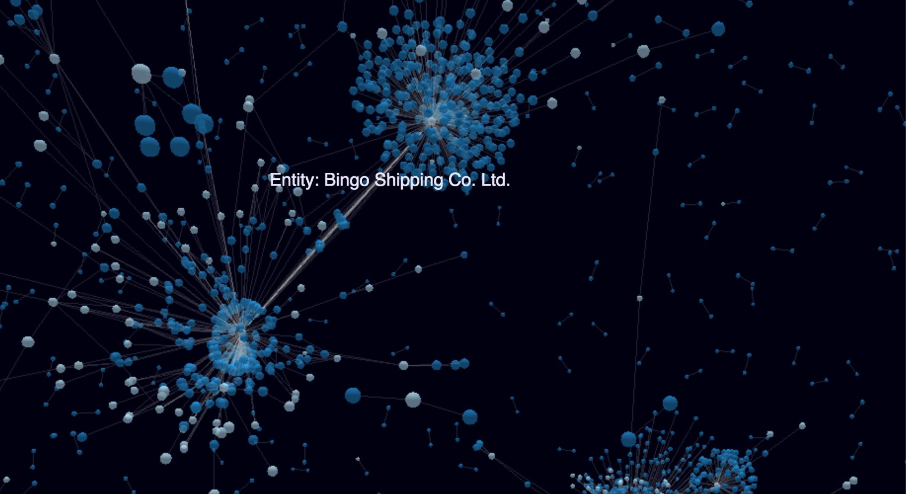

:base: https://rawgit.com/jexp/neo4j-3d-force-graph/master

Some experiments using Data in Neo4j to render 3d graphs using three-js via https://github.com/vasturiano/3d-force-graph[3d-force-graph] which is a really cool repository.

These pages use the Neo4j javascript driver to query the graph for some basic data and render it in the 3d-graph.

The pages load 5000 relationships from your graph at bolt://localhost, you might need to set auth (default is user: neo4j, password: test)

* link:{base}/index.html[basic loading] just using the id's (fastest) link:index.html[index.html]
* link:{base}/incremental.html[incremental loading] each row from the driver result is added to the graph incrementally link:incremental.html[incremental.html]
* link:{base}/color.html[color by label and caption on hover] loads `{ id: id(n), label:head(labels(n)), caption:n.name }` per node link:color.html[color.html]

